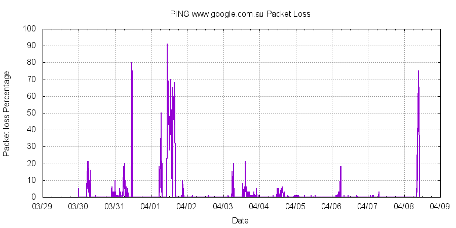
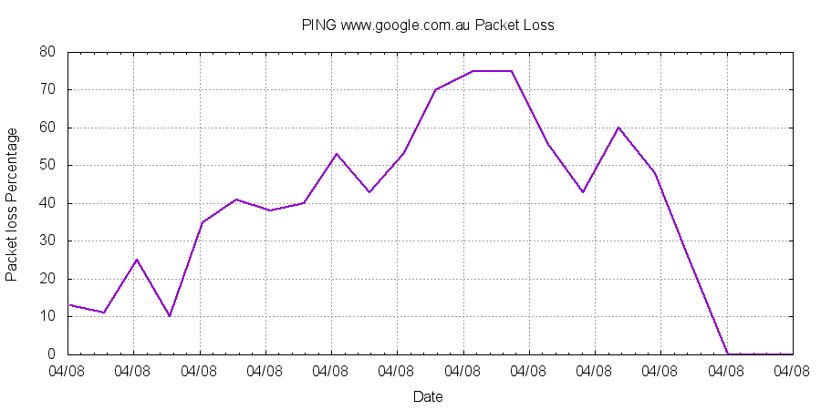

About a month ago I signed up for the Optus cable internet, with the expectation that the performance would blow away my old TPG ADSL2+ connection. The promise of 100Mb internet was very appealing.

In reality it has been a disaster, as the internet access has been very unreliable and often unusable. To compound matters, the deal includes an Optus home phone, which uses internet connection. Hence the home phone also becomes unusable.

To track the quality of the internet connection, I have been running a script for a number of days (love my Raspberry Pi 2) that pings `www.google.com.au` every 5 seconds for 5 minute intervals. The script is:

    #!/bin/bash
    
    trap '{ echo Bye bye; exit 1; }' SIGINT SIGTERM
    
    while true; do
        date +'%F %T'
        ping -i 5 -c 60 www.google.com.au
    done

I have been running this using `nohup` so it will not terminate:

    nohup ./run.sh >& ping-output.log &
    
The output looks something like:

    2015-04-08 20:04:08
    PING www.google.com.au (74.125.237.207) 56(84) bytes of data.
    64 bytes from syd01s19-in-f15.1e100.net (74.125.237.207): icmp_req=1 ttl=53 time
    =51.3 ms
    64 bytes from syd01s19-in-f15.1e100.net (74.125.237.207): icmp_req=2 ttl=53 time
    =13.2 ms
    ...
    64 bytes from syd01s19-in-f15.1e100.net (74.125.237.207): icmp_req=57 ttl=53 time=19.3 ms
    64 bytes from syd01s19-in-f15.1e100.net (74.125.237.207): icmp_req=58 ttl=53 time=13.0 ms
    64 bytes from syd01s19-in-f15.1e100.net (74.125.237.207): icmp_req=59 ttl=53 time=16.7 ms
    
    --- www.google.com.au ping statistics ---
    60 packets transmitted, 44 received, 26% packet loss, time 295246ms
    rtt min/avg/max/mdev = 11.737/20.098/61.069/10.259 ms

Note, in the sample output above there is `26%` packet loss over a 5 minute period!

I then wrote a [Groovy](http://groovy-lang.org/) script to convert the output to a CSV file, and then used [Gnuplot](http://www.gnuplot.info/) to generate graphs.

The following graph shows the packet loss from `2015-03-30 10:49:23` through to `2015-04-08 20:24:55`.

As can be clearly be seen above, there are periods where there is significant packet loss, and the internet AND phone are unusable.

Tonight at around `19:14` the internet was unusable and I tried to make a phone call (the phone is wired directly into the cable modem) and was unsuccessful. I mention this as I effectively unable to contact Optus support (my mobile is an Optus mobile dead zone!).

The following graph shows the packet loss from `2015-04-08 18:30:25` through to `2015-04-08 20:24:55`.

I reach the point where clearly the Optus internet is not "fit-for-purpose". Let's hope that when I do get through to them, they address the problem. Stay tuned.
