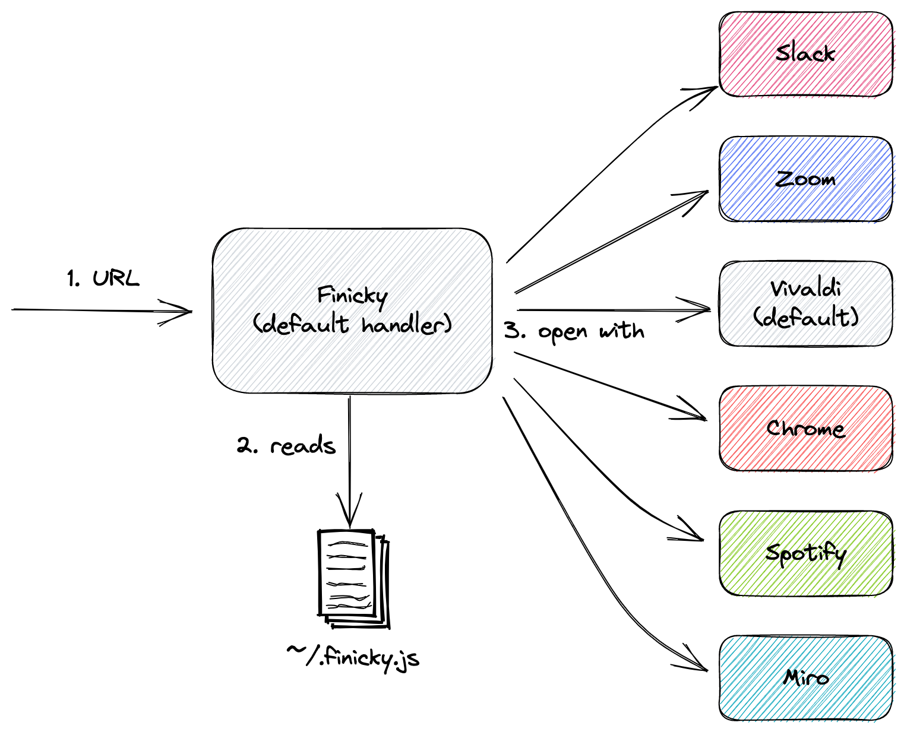

# Context

Let me share the biggest producitivy hack I made in 2022. For a while I have been frustrated at the handling of opening URLs on both my work and personal MacBook laptops. I want the ability to open certain URLs in different applications.

For example:

- Zoom/Miro/Spotify links in the corresponding native applications.
- Specific URLs, like news websites, in the Chrome browser under my personal profile.
- Open all URLs in the [Signal Desktop](https://signal.org/en/download/macos/) using the Chrome browser under my personal profile.
- Everything else using my default browser, which is [Vivaldi](https://vivaldi.com).

# Solution

## Enter Finicky

Enter [Finicky](https://github.com/johnste/finicky) which provides a way to programmatically (in JavaScript) describe how URLs are to be handled. It works by being registered as the default URL handler on MacOS. When it is invoked, it consults the file `~/.finicky.js` to determine which application will handle the URL.

The following diagram gives an overview of how the flow works.



I installed Finicky using `brew install --cask finicky`, and found the documentation to be excellent. I will now describe my current configuration.

## Defining a default handler
Since I use Vivaldi as my default browser, the following snippet defines how a URL will be handled by default.

```js
module.exports = {
  defaultBrowser: "Vivaldi"
}
```

## Defining specific native handlers
The following snippet shows how to define handlers for different native applications.

```js
module.exports = {
  handlers: [
    {
      match: "open.spotify.com/*",
      browser: "Spotify"
    },
    {
      match: [
        /miro.com\/app\/board\//,
      ],
      browser: "com.electron.realtimeboard"
    },
    {
      match: [
        /zoom.us\/j\//,
      ],
      browser: "us.zoom.xos"
    },
    {
      match: [
        /https:\/\/atlassian.slack.com\/archives\//,
      ],
      browser: "Slack"
    }
  ]
}
```

## Opening specific URLs in Chrome
The following snippet shows how to open specific URLs in my Google Chrome browser, using my personal profile.

```js
module.exports = {
  handlers: [
    {
      match: [
        finicky.matchHostnames([
          /abc.net.au$/,
          /news.com.au$/,
          /smh.com.au$/
        ]),
      ],
      browser: {
        name: "Google Chrome",
        profile: "Profile 2"
      }
    }
  ]
}
```

## Opening all URLs from Signal Desktop
Since I use the Signal Desktop for personal use only, I want to open all URLs from Signal using the Chrome browser under my personal profile. The following snippet shows how to achieve this.

```js
module.exports = {
  handlers: [
    {
      match: ({ opener }) =>
        opener.bundleId === "org.whispersystems.signal-desktop",
      browser: {
        name: "Google Chrome",
        profile: "Profile 2"
      }
    }
  ]
}
```

## Complete configuration
Here is what my `~/.finicky.js` configuration looks like.

```js
// See https://github.com/johnste/finicky

module.exports = {
  defaultBrowser: "Vivaldi",
  handlers: [
    {
      match: ({ opener }) =>
        opener.bundleId === "org.whispersystems.signal-desktop",
      browser: {
        name: "Google Chrome",
        profile: "Profile 2"
      }
    },
    {
      match: "open.spotify.com/*",
      browser: "Spotify"
    },
    {
      match: [
        /miro.com\/app\/board\//,
      ],
      browser: "com.electron.realtimeboard"
    },
    {
      match: [
        /zoom.us\/j\//,
      ],
      browser: "us.zoom.xos"
    },
    {
      match: [
        /https:\/\/atlassian.slack.com\/archives\//,
      ],
      browser: "Slack"
    },
    {
      match: [
        finicky.matchHostnames([
          /abc.net.au$/,
          /news.com.au$/,
          /smh.com.au$/
        ]),
      ],
      browser: {
        name: "Google Chrome",
        profile: "Profile 2"
      }
    }
  ]
}
```

# Footnote
This blog was originally posted on my [personal blog](https://www.puppycrawl.com/blog). I have decided to start writing my non-work blog posts here and then cross posting to either my work or [dev.to](https://dev.to/oliverburn) blogs. 

Since I joined Atlassian I have publicly stopped blogging, but in reality I have been blogging more than ever. In 2023 I am experimenting with making certain blogs more widely visible.
